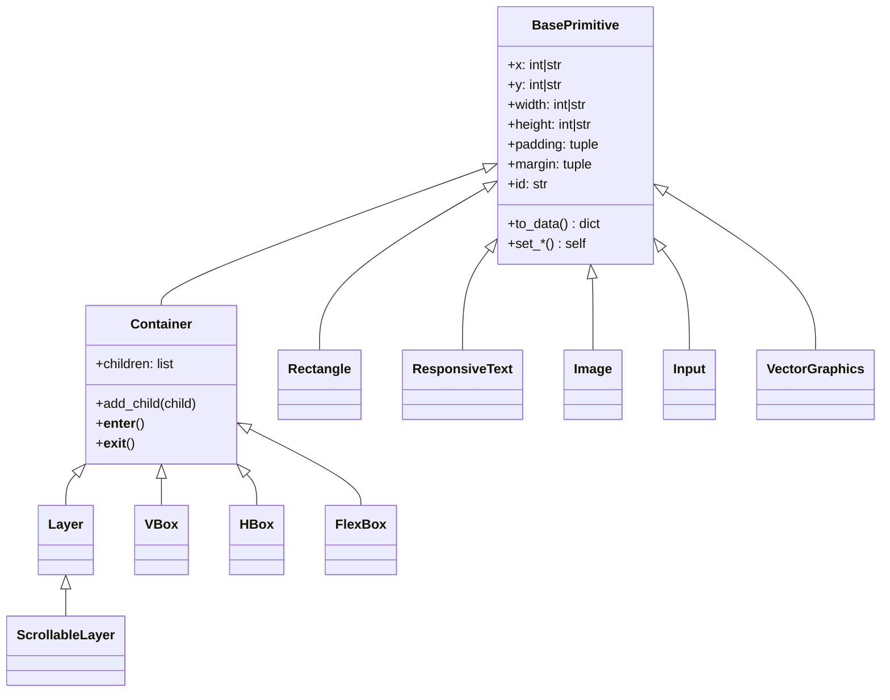

# Lumen - SDL2 GUI Library for Python

Lumen is a declarative GUI library built on SDL2 for creating beautiful, responsive user interfaces in Python. It provides a modern layout system inspired by CSS Flexbox, along with a rich set of primitives for rendering graphics, text, and interactive elements.

## Features

- **Declarative UI**: Build interfaces using a component-based approach
- **Flexbox Layout**: Powerful layout system with `VBox`, `HBox`, and full `FlexBox` support
- **Rich Primitives**: Rectangles, text, images, vector graphics, and input fields
- **Responsive Design**: Percentage-based sizing and positioning
- **Event Handling**: Click, scroll, keyboard, and focus events
- **Context Manager Support**: Implicit parent-child relationships with `with` statements

## Installation

```bash
pip install pysdl2 pysdl2-dll
# Then add Lumen to your project
```

## Quick Start

```python
from sdl_gui.window.window import Window
from sdl_gui.layouts.vbox import VBox
from sdl_gui.primitives.rectangle import Rectangle
from sdl_gui.primitives.responsive_text import ResponsiveText

# Create window
win = Window("My App", 800, 600)

# Build UI
root = VBox(x=0, y=0, width="100%", height="100%", padding=(20, 20, 20, 20))
root.add_child(Rectangle(0, 0, "100%", 50, color=(100, 150, 255, 255)))
root.add_child(ResponsiveText(0, 0, "100%", 30, text="Hello Lumen!", size=24))

# Main loop
running = True
while running:
    for event in win.get_ui_events():
        if event.get("type") == "quit":
            running = False
    win.render([root.to_data()])
```

## Architecture



## Documentation Index

- [Core Concepts](concepts.md) - Positioning, sizing, padding, margin
- [Primitives](primitives.md) - Rectangle, Text, Image, Input, VectorGraphics
- [Layouts](layouts.md) - VBox, HBox, FlexBox
- [Layers](layers.md) - Layer, ScrollableLayer
- [Events](events.md) - Event handling and interaction
- [Examples](examples.md) - Code examples and patterns

## License

MIT License
