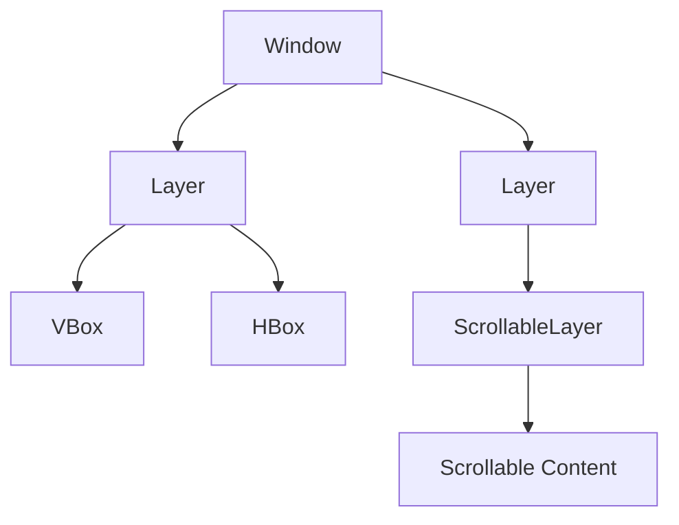

# Layers

Layers are special containers that define isolated rendering contexts. They are useful for grouping content and enabling features like scrolling.

## Layer

A basic container that groups children together with its own coordinate system.

```python
from sdl_gui.layers.layer import Layer

# Create a layer
layer = Layer(x="10%", y="10%", width="80%", height="80%", id="main_layer")

# Add children
layer.add_child(Rectangle(0, 0, "100%", 50, (255, 0, 0, 255)))
layer.add_child(Rectangle(0, 0, "100%", 50, (0, 255, 0, 255)))
```

### Properties

| Property | Type | Default | Description |
|----------|------|---------|-------------|
| `x` | `int \| str` | required | X position |
| `y` | `int \| str` | required | Y position |
| `width` | `int \| str` | required | Layer width |
| `height` | `int \| str` | required | Layer height |
| `id` | `str` | `None` | Unique identifier |
| `listen_events` | `list` | `[]` | Events this layer responds to |

### Use Cases

- Grouping related content
- Creating modals or popups
- Isolating coordinate systems for nested positioning

---

## ScrollableLayer

A layer that supports vertical scrolling for content that exceeds the visible area.

```python
from sdl_gui.layers.scrollable_layer import ScrollableLayer

scroll = ScrollableLayer(
    x=0, y=0,
    width="100%", height=400,
    scroll_y=0,
    content_height=1000,  # Total height of scrollable content
    id="scroll_container",
    listen_events=["scroll"]
)

# Add tall content
for i in range(20):
    scroll.add_child(Rectangle(0, i * 50, "100%", 45, (100, 100, 100, 255)))
```

### Properties

| Property | Type | Default | Description |
|----------|------|---------|-------------|
| `scroll_y` | `int` | `0` | Current vertical scroll offset |
| `content_height` | `int` | `0` | Total height of content |

### Handling Scroll Events

```python
def handle_event(event):
    if event.get("type") == "scroll":
        target_id = event.get("target")
        if target_id == "scroll_container":
            delta = event.get("delta")
            current = event.get("current_scroll_y", 0)
            
            # Update scroll position
            new_scroll = current - (delta * 30)  # Scroll speed
            new_scroll = max(0, min(new_scroll, content_height - visible_height))
            scroll.scroll_y = new_scroll
```

### Example: Infinite Scroll

```python
class InfiniteScrollDemo:
    def __init__(self):
        self.items = self.load_initial_items()
        self.scroll_y = 0
        
    def build_ui(self):
        scroll = ScrollableLayer(
            x=0, y=0,
            width="100%", height="100%",
            scroll_y=self.scroll_y,
            content_height=len(self.items) * 100,
            id="infinite_scroll",
            listen_events=["scroll"]
        )
        
        # Only render visible items for performance
        visible_start = self.scroll_y // 100
        visible_end = visible_start + 10
        
        for i in range(visible_start, min(visible_end, len(self.items))):
            item = self.create_item_card(self.items[i], i * 100)
            scroll.add_child(item)
            
        return scroll
```

---

## Layer Hierarchy



Layers can be nested and combined with layouts:

```python
# Root layer
root = Layer(0, 0, "100%", "100%")

# Header area
header = Layer(0, 0, "100%", 60)
header.add_child(Rectangle(0, 0, "100%", "100%", (50, 50, 50, 255)))

# Scrollable content area
content = ScrollableLayer(0, 60, "100%", "calc(100% - 60)",
                          scroll_y=0, content_height=2000,
                          id="main_scroll", listen_events=["scroll"])

display_list = [
    root.to_data(),
    header.to_data(),
    content.to_data()
]
```
