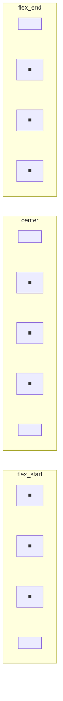

# Layouts

Layouts are containers that automatically position their children. Lumen provides three layout types: `VBox`, `HBox`, and `FlexBox`.

## VBox (Vertical Box)

Stacks children vertically from top to bottom.

```python
from sdl_gui.layouts.vbox import VBox
from sdl_gui.primitives.rectangle import Rectangle

vbox = VBox(x=0, y=0, width="100%", height="100%", padding=(20, 20, 20, 20))
vbox.add_child(Rectangle(0, 0, "100%", 50, (255, 0, 0, 255)))
vbox.add_child(Rectangle(0, 0, "100%", 50, (0, 255, 0, 255)))
vbox.add_child(Rectangle(0, 0, "100%", 50, (0, 0, 255, 255)))
```

```
┌────────────────────────┐
│  ┌──────────────────┐  │
│  │      Red         │  │
│  └──────────────────┘  │
│  ┌──────────────────┐  │
│  │      Green       │  │
│  └──────────────────┘  │
│  ┌──────────────────┐  │
│  │      Blue        │  │
│  └──────────────────┘  │
└────────────────────────┘
```

---

## HBox (Horizontal Box)

Stacks children horizontally from left to right.

```python
from sdl_gui.layouts.hbox import HBox

hbox = HBox(x=0, y=0, width="100%", height=100, padding=(10, 10, 10, 10))
hbox.add_child(Rectangle(0, 0, "30%", "100%", (255, 0, 0, 255)))
hbox.add_child(Rectangle(0, 0, "30%", "100%", (0, 255, 0, 255)))
hbox.add_child(Rectangle(0, 0, "30%", "100%", (0, 0, 255, 255)))
```

```
┌─────────────────────────────────┐
│ ┌────────┐ ┌────────┐ ┌────────┐│
│ │  Red   │ │ Green  │ │  Blue  ││
│ └────────┘ └────────┘ └────────┘│
└─────────────────────────────────┘
```

---

## FlexBox

A powerful layout system based on CSS Flexbox for complex, responsive layouts.

```python
from sdl_gui.layouts.flexbox import FlexBox

flex = FlexBox(
    x=0, y=0,
    width="100%", height="100%",
    flex_direction="row",
    justify_content="space_between",
    align_items="center",
    gap=20,
    padding=(20, 20, 20, 20)
)
```

### FlexBox Properties

| Property | Type | Default | Description |
|----------|------|---------|-------------|
| `flex_direction` | `str` | `"row"` | Main axis direction |
| `justify_content` | `str` | `"flex_start"` | Distribution along main axis |
| `align_items` | `str` | `"stretch"` | Alignment along cross axis |
| `flex_wrap` | `str` | `"nowrap"` | Wrapping behavior |
| `gap` | `int` | `0` | Space between children |

---

## flex_direction

Controls the main axis direction.

| Value | Description |
|-------|-------------|
| `row` | Left to right (default) |
| `column` | Top to bottom |

```python
# Horizontal layout
FlexBox(flex_direction="row")

# Vertical layout  
FlexBox(flex_direction="column")
```

---

## justify_content

Controls how children are distributed along the **main axis**.



| Value | Description |
|-------|-------------|
| `flex_start` | Pack at start (default) |
| `center` | Pack at center |
| `flex_end` | Pack at end |
| `space_between` | Even spacing, first/last at edges |
| `space_around` | Even spacing, half-space at edges |
| `space_evenly` | Completely even spacing |

### Visual Comparison

```
flex_start:      [■][■][■]
center:              [■][■][■]
flex_end:                    [■][■][■]
space_between:   [■]      [■]      [■]
space_around:     [■]    [■]    [■]
space_evenly:      [■]   [■]   [■]
```

### Example

```python
# Evenly distribute three items
row = FlexBox(
    x=0, y=0, width="100%", height=100,
    flex_direction="row",
    justify_content="space_between"
)
row.add_child(Rectangle(0, 0, 50, 50, (255, 0, 0, 255)))
row.add_child(Rectangle(0, 0, 50, 50, (0, 255, 0, 255)))
row.add_child(Rectangle(0, 0, 50, 50, (0, 0, 255, 255)))
```

---

## align_items

Controls how children are aligned along the **cross axis**.

| Value | Description |
|-------|-------------|
| `flex_start` | Align to start of cross axis |
| `center` | Center on cross axis |
| `flex_end` | Align to end of cross axis |
| `stretch` | Stretch to fill cross axis (default) |

### Visual Comparison (with flex_direction="row")

```
flex_start:     ┌─────────────────────┐
                │ [■] [■] [■]         │
                │                     │
                │                     │
                └─────────────────────┘

center:         ┌─────────────────────┐
                │                     │
                │ [■] [■] [■]         │
                │                     │
                └─────────────────────┘

flex_end:       ┌─────────────────────┐
                │                     │
                │                     │
                │ [■] [■] [■]         │
                └─────────────────────┘

stretch:        ┌─────────────────────┐
                │ [█] [█] [█]         │
                │ [█] [█] [█]         │
                │ [█] [█] [█]         │
                └─────────────────────┘
```

---

## flex_wrap

Controls whether items wrap to new lines.

| Value | Description |
|-------|-------------|
| `nowrap` | Single line, items may overflow (default) |
| `wrap` | Items wrap to new lines |

```python
# Allow wrapping when items don't fit
flex = FlexBox(
    flex_direction="row",
    flex_wrap="wrap",
    gap=10
)
```

---

## gap

Space between children in pixels.

```python
# 20px gap between all children
flex = FlexBox(gap=20)
```

---

## Flex Item Properties

Children of a FlexBox can have individual flex properties set via the fluent API:

### flex_grow

How much the item should grow relative to siblings.

```python
item1 = Rectangle(0, 0, 100, 50, (255, 0, 0, 255))
item1.set_flex_grow(1)  # Takes 1 part of extra space

item2 = Rectangle(0, 0, 100, 50, (0, 255, 0, 255))
item2.set_flex_grow(2)  # Takes 2 parts of extra space
```

### flex_shrink

How much the item should shrink if space is limited.

```python
item.set_flex_shrink(0)  # Don't shrink
item.set_flex_shrink(1)  # Shrink proportionally (default)
```

### flex_basis

Initial size before growing/shrinking.

```python
item.set_flex_basis(200)   # 200px initial size
item.set_flex_basis(0)     # Start from 0, grow equally
```

---

## Common Patterns

### Equal Width Columns

```python
row = FlexBox(x=0, y=0, width="100%", height=200, flex_direction="row", gap=20)

col1 = FlexBox(x=0, y=0, width="auto", height="100%")
col1.set_flex_grow(1).set_flex_basis(0)

col2 = FlexBox(x=0, y=0, width="auto", height="100%")
col2.set_flex_grow(1).set_flex_basis(0)

col3 = FlexBox(x=0, y=0, width="auto", height="100%")
col3.set_flex_grow(1).set_flex_basis(0)

row.add_child(col1)
row.add_child(col2)
row.add_child(col3)
```

### Centered Content

```python
container = FlexBox(
    x=0, y=0, width="100%", height="100%",
    justify_content="center",
    align_items="center"
)
container.add_child(modal_box)
```

### Header/Content/Footer Layout

```python
root = FlexBox(x=0, y=0, width="100%", height="100%", flex_direction="column")

header = Rectangle(0, 0, "100%", 60, (50, 50, 50, 255))
content = FlexBox(0, 0, "100%", "auto").set_flex_grow(1)  # Takes remaining space
footer = Rectangle(0, 0, "100%", 40, (50, 50, 50, 255))

root.add_child(header)
root.add_child(content)
root.add_child(footer)
```

### Sidebar Layout

```python
main = FlexBox(x=0, y=0, width="100%", height="100%", flex_direction="row")

sidebar = FlexBox(0, 0, 250, "100%")  # Fixed 250px width
content = FlexBox(0, 0, "auto", "100%").set_flex_grow(1)  # Fill remaining

main.add_child(sidebar)
main.add_child(content)
```
